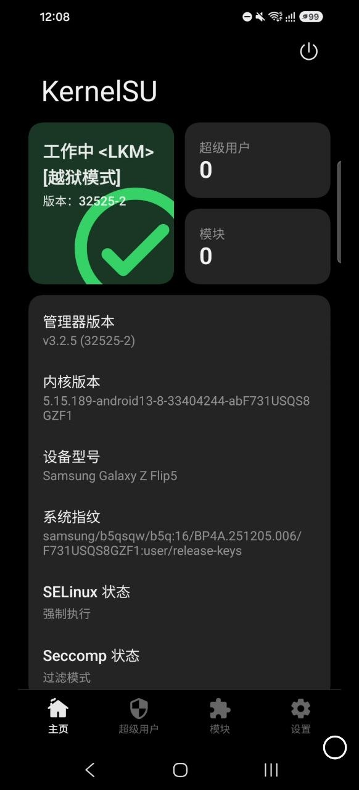

# SM-F731U F731USQS8GZF1 — KernelSU 验证记录

## 验证结果（2026-08-12 真机）

**Galaxy Z Flip 5 美版（SM-F731U/DS，T-Mobile 运营商锁）临时 root 成功。**



KernelSU 管理器确认：

| 项目 | 值 |
| --- | --- |
| KernelSU 状态 | **工作中 \<LKM\>（监狱模式）** |
| 管理器版本 | v3.2.5 (32525-2) |
| 内核版本 | `5.15.189-android13-8-33404244-abF731USQS8GZF1` |
| 设备型号 | Samsung Galaxy Z Flip 5 |
| 系统指纹 | `samsung/b5qsqw/b5q:16/BP4A.251205.006/F731USQS8GZF1:user/release-keys` |
| SELinux | 强制执行（Enforcing） |
| Seccomp | 过滤模式 |

## Exploit 日志（v0.2.34）

```text
[*] stage=starting-temporary-root
[+] stage=temporary-root-ready
[+] exploit completed attempt=1/24
[+] 已获取 bootstrap root
[*] 正在 late-load KernelSU
[+] KernelSU 暂存完成
[+] KernelSU 控制通道已验证
[*] KernelSU 已启用
[+] 安装完成
```

**第一次尝试即成功，全程零重启。** SELinux 保持强制执行，root 干净。

## 说明

- **临时 root**：锁 bootloader（T-Mobile 美版无 OEM 解锁），重启后失效，需要 root 时重跑 App（10 秒）
- 本页图片为 KernelSU 管理器截图，证明 bootstrap root + KernelSU LKM 装载 + 管理器识别全链路工作
